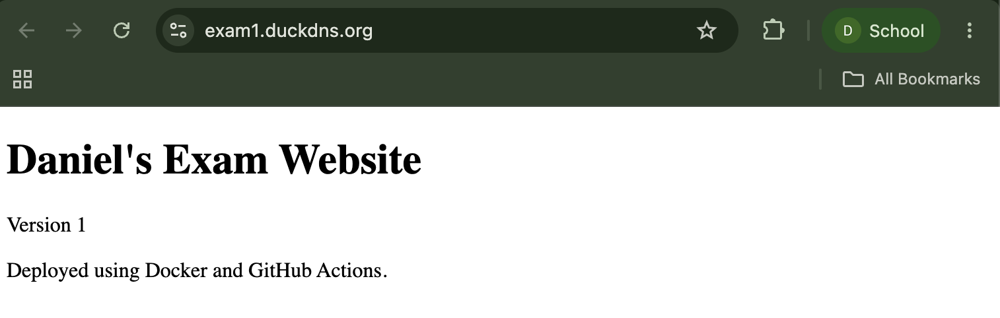
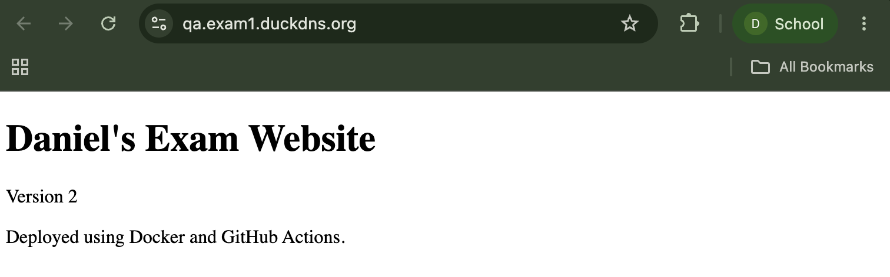
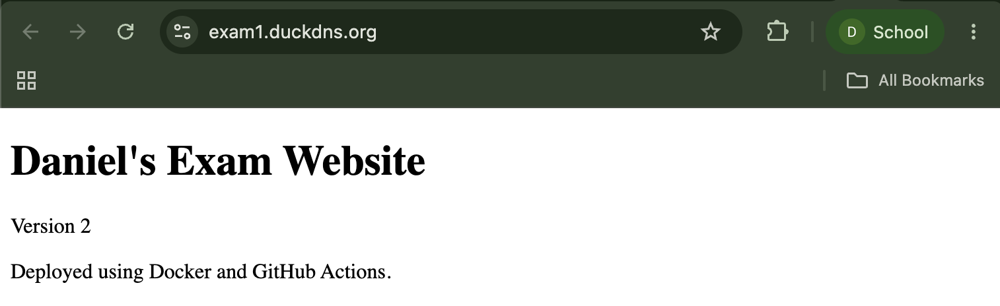

# Daniel's Containerized Website

**Production:** https://exam1.duckdns.org  
**QA:** https://qa.exam1.duckdns.org

## Server and deployment

The website runs in Docker containers on my DigitalOcean Ubuntu Droplet.
Administration and deployment use the non-root account dan38 with SSH keys.
Direct root SSH login, password authentication, and keyboard-interactive
authentication are disabled.

Pushes to qa automatically deploy QA. Changes are reviewed in a pull request
from qa into main, then merged to deploy production. QA and production use
separate Docker Compose projects and localhost ports 8081 and 8080.
Caddy routes each hostname to its environment and provides HTTPS.

## CI/CD

GitHub Actions runs on pushes to qa and main. It checks that the HTML contains
the required page structure, builds the Docker image, and tests that the
container serves the page. A failed validation, build, or container test
stops deployment.

Successful images are pushed to GitHub Container Registry with the commit
SHA as the image tag. The workflow connects to the Droplet as dan38,
pulls the image, updates the selected environment, and checks its HTTPS URL.
SSH credentials are stored in GitHub Actions secrets. Registry access uses
the workflow's temporary GITHUB_TOKEN.

## Test Evidence

### Successful workflow runs and images

- [QA Version 2 workflow](https://github.com/dan38-cmyk/exam1/actions/runs/37822159154)
- [Production promotion workflow](https://github.com/dan38-cmyk/exam1/actions/runs/37822534323)
- [Image registry package](https://github.com/users/dan38-cmyk/packages/container/package/exam1)
- QA demonstrated image: ghcr.io/dan38-cmyk/exam1:95c0c3c291ac1787cfd0d42d17c21a31c6212e0a
- Production demonstrated image: ghcr.io/dan38-cmyk/exam1:5d836533f2df86292bf1e529638cea101e9385d0

The README/evidence commit triggers another production deployment.
Its image tag is that new commit's SHA and appears in the workflow summary.

### QA to production demonstration

QA displayed Version 2 while production remained on Version 1.
After reviewing and merging qa into main, production displayed Version 2.

Production before promotion:

QA before promotion:

Production after promotion:

### SSH security evidence

- [SSH-key login as dan38](evidence/key-login.txt)
- [Effective SSH settings](evidence/ssh-settings.txt)
- [Root SSH login rejected](evidence/root-rejected.txt)
- [Password-only SSH login rejected](evidence/password-rejected.txt)

Effective settings are PermitRootLogin no, PasswordAuthentication no,
KbdInteractiveAuthentication no, and PubkeyAuthentication yes.
